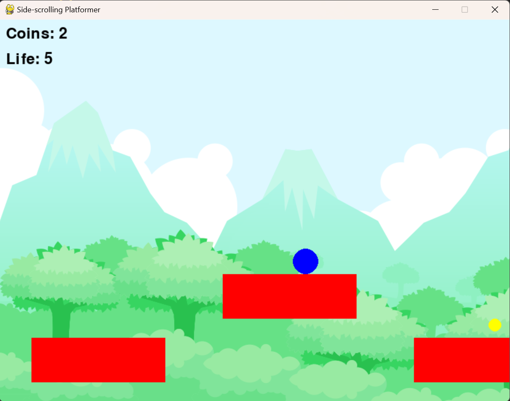

# Simple Platformer

This is a simple side-scrolling platformer game built using Python's Pygame Library.

## Preview



## Requirements

- Python 3.10.0
- Pygame

You can install the required dependencies using the following command:

```sh
pip install -r requirements.txt
```

## How to Run

To run the game, execute the following command:

```sh
python main.py
```

## Game Controls

- **Left Arrow**: Move left
- **Right Arrow**: Move right
- **Up Arrow**: Jump

## Game Structure

### Player

The Player class represents the player character. It is a subclass of pygame.sprite.Sprite and includes methods for movement, jumping, and gravity.

### Platform

The Platform class represents the platforms that the player can jump on. It is also a subclass of pygame.sprite.Sprite.

### Level

The Level class is a generic superclass used to define a level. It includes methods for updating and drawing the level, as well as shifting the world when the player moves.

### Levels

- Level_01 : Definition for level 1
- Level_02 : Definition for level 2.

## License

This project is licensed under the MIT License. See the [LICENSE](LICENSE) file for details.
